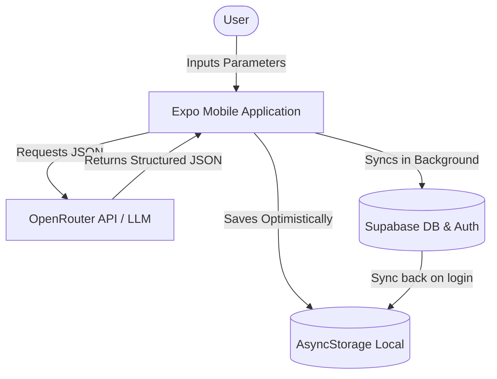

# SkillMap 🚀
**The ultimate technical learning platform for modern developers.**


SkillMap is a premium, high-performance cross-platform mobile application built with **React Native** and **Expo**. It transforms the daunting task of learning complex technologies into a structured, gamified journey. Featuring an **AI-powered roadmap generator**, **real-time cloud progress tracking**, and a **"Stellar Glass" UI/UX**, SkillMap is designed to help developers achieve technical mastery with ease.

---

## 📋 Table of Contents
1. [Project Overview & Value Proposition](#-project-overview--value-proposition)
2. [Presentation & PPT Slides Outline](#-presentation--ppt-slides-outline)
3. [User Experience & Screen Design](#-user-experience--screen-design)
4. [System Architecture & Data Flow](#-system-architecture--data-flow)
5. [Database Schema & Backend Setup](#-database-schema--backend-setup)
6. [AI Integration & Prompt Engineering](#-ai-integration--prompt-engineering)
7. [Tech Stack Breakdown](#-tech-stack-breakdown)
8. [Project Structure & Component Directory](#-project-structure--component-directory)
9. [Getting Started & Configuration](#-getting-started--configuration)

---

## 🌟 Project Overview & Value Proposition

### 🔴 The Problem
Traditional tech tutorials and guides suffer from three main friction points:
1. **Information Overload**: A search for "how to learn backend" returns millions of scattered links, leading to choice paralysis.
2. **Lack of Structure**: Learners jump from one resource to another without understanding dependencies (e.g. learning database migrations before learning SQL).
3. **No Motivation Loop**: Textbooks and long video courses lack feedback systems, causing learners to lose consistency and drop out.

### 🟢 The Solution
SkillMap bridges this gap by combining **AI-driven personalization** with **game mechanics** and **structured pre-built pathways**:
* **Structured Roadmaps**: Learners progress through modular nodes (Modules) containing sub-topics, task checklists, and curated resources.
* **AI Roadmap Generator**: Instantly charts a custom learning path for any niche topic (e.g., "Svelte", "Docker", "Machine Learning") based on user-defined timeline, difficulty, and goal.
* **Gamified Motivation**: Tracks consistency using **XP rewards**, **Daily Streaks**, and **Unlockable Milestones** visualized on a futuristic progress ring.
* **Hybrid Storage Architecture**: Works offline-first using local cache, and syncs automatically with a cloud database (Supabase) once online.

---

## 📊 Presentation & PPT Slides Outline

This structured outline is ready to be copied directly into presentation slides or an academic project report.

| Slide # | Slide Title | Core Bullet Points | Visual/Interactive Suggestions |
|---|---|---|---|
| **1** | **Title Slide** | • SkillMap<br>• The Gamified, AI-Powered Learning Companion<br>• Built with React Native & Supabase | Show app screenshot or mockups. |
| **2** | **The Problem** | • Cognitive overload in technical learning<br>• Lack of clear, structured dependencies<br>• High drop-out rates due to low engagement | Visual representation of "Scattered vs Structured" learning. |
| **3** | **Our Solution** | • AI roadmaps generated on the fly<br>• Pre-built curated career pathways<br>• High-performance gamified mobile application | High-level screenshot of the Home Dashboard. |
| **4** | **Core Features: AI Roadmaps** | • Model-agnostic OpenRouter Integration<br>• Custom durations (weeks to years)<br>• 4 actionable, granular tasks per week | Mockup of the "Generate Skills" questionnaire form. |
| **5** | **Core Features: Gamification** | • Dynamic SVG Mastery Progress Ring<br>• XP points for task completion<br>• Daily streak counter and milestone badges | SVG ring diagram showing progress percentage. |
| **6** | **Technical Architecture** | • Cross-platform: iOS & Android (Expo SDK 54)<br>• Backend: Supabase (Auth, Profiles, Cloud Sync)<br>• Storage: Local cache (AsyncStorage) + Cloud sync | Architecture diagram showing frontend-backend sync flow. |
| **7** | **Database Schema** | • `profiles` table for identity and demographics<br>• `ai_roadmaps` table containing JSONB structures | Schema ER diagram showing relation between user and roadmaps. |
| **8** | **Why SkillMap Wins** | • Sleek Bento layout & "Stellar Glass" design<br>• Seamless offline-first reliability<br>• Extensible static & dynamic syllabus | Chart showing retention rate improvement using streaks. |

---

## 🎨 User Experience & Screen Design

SkillMap's interface features a dark-themed glassmorphism design (referred to as **Stellar Glass**) built for night coding sessions and focus.

```
       ┌────────────────────────┐
       │   Welcome Back, user   │  <-- Home Dashboard (tabs)/index.js
       │  🔥 5 Day Streak        │
       ├────────────────────────┤
       │   BENTO STATS GRID     │  <-- 0% Mastery, 400 XP, 0 Trophies
       ├────────────────────────┤
       │   ACTIVE TRACKS CARD   │  <-- Interactive Progress Bars
       └────────────────────────┘
```

### 1. Home Dashboard (`(tabs)/index.js`)
* **Bento Stats Grid**: Sleek grid displaying the user's current progress: XP Points, Streaks, and overall Mastery %.
* **Active Tracks**: Lists roadmaps that are currently in progress with horizontal progress bars representing completion.
* **Deterministic Daily Tips**: A banner that changes daily, giving users learning tips (e.g. "Consistency beats intensity").

### 2. Roadmap Explorer (`(tabs)/roadmap.js`)
* **Career Pathways**: Browse pre-built comprehensive paths such as *Frontend Engineer*, *Backend Developer*, and upcoming ones like *DevOps* or *AI Engineer*.
* **Skill Pathways**: Dedicated paths for specific programming languages or tools, like *Python Mastery* or *React Deep Dive*.
* **Interactive Module List**: Modules display as nodes along a dynamic spine. Selecting a module launches a checklist of sub-topics.

### 3. AI Skills Generator (`(tabs)/skills.js`)
* **Custom Parameter Form**: Users enter a topic, select a duration (e.g. 3 months), pick difficulty (Beginner, Intermediate, Advanced), and input a project goal.
* **Animated Loading State**: Bouncing dots and a cycling step text (e.g., "Analysing topic...", "Planning weekly goals...") that keep users engaged while the LLM processes.
* **Roadmap Render & Save**: Dynamically generates the UI for the JSON roadmap and automatically syncs it to the cloud.

### 4. Profiles & Vault (`(tabs)/profile.js`)
* **SVG Mastery Ring**: A custom circular SVG progress tracker dynamically updating based on overall subtopic completion.
* **Identity Vault**: A secure credentials and profile management system allowing users to update names synced with Supabase.
* **Milestone Section**: Displays badges and trophies earned as the user achieves learning checkpoints.

---

## ⚙️ System Architecture & Data Flow

SkillMap uses a modern, offline-first cloud-synchronized architecture.



### Data Synchronization Flow
1. **Instant UI Render**: On load, the app reads data from `AsyncStorage`. This ensures the UI is interactive in under 100 milliseconds.
2. **Background Reconciliation**: The app queries Supabase for any updates or newly generated roadmaps on other devices.
3. **Optimistic Updates**: When a user completes a task or deletes a roadmap, the change is written to `AsyncStorage` immediately and synced to Supabase asynchronously, avoiding spinner-blocked UI.

---

## 🗄 Database Schema & Backend Setup

SkillMap integrates with **Supabase** for database, user authentication, and row-level security. Run the following SQL in your Supabase SQL Editor to construct the schema:

```sql
-- 1. Create a table for User Profiles linked to Supabase Auth
create table public.profiles (
  id uuid references auth.users on delete cascade primary key,
  first_name text not null,
  last_name text,
  phone text,
  birth_date text,
  email text,
  updated_at timestamp with time zone default timezone('utc'::text, now()) not null
);

-- 2. Create a table for AI Generated Roadmaps
create table public.ai_roadmaps (
  id uuid default gen_random_uuid() primary key,
  user_id uuid references auth.users on delete cascade not null,
  title text not null,
  topic text not null,
  duration text not null,
  level text not null,
  goal text not null,
  total_weeks integer not null,
  xp_total integer not null,
  phases jsonb not null,
  created_at timestamp with time zone default timezone('utc'::text, now()) not null
);

-- 3. Enable Row Level Security (RLS)
alter table public.profiles enable row level security;
alter table public.ai_roadmaps enable row level security;

-- 4. Set security policies for Profiles
create policy "Allow public read access to profiles" on public.profiles 
  for select using (true);

create policy "Allow users to update their own profile" on public.profiles 
  for update using (auth.uid() = id);

create policy "Allow users to insert their own profile" on public.profiles 
  for insert with check (auth.uid() = id);

-- 5. Set security policies for AI Roadmaps
create policy "Allow users to read their own roadmaps" on public.ai_roadmaps 
  for select using (auth.uid() = user_id);

create policy "Allow users to insert their own roadmaps" on public.ai_roadmaps 
  for insert with check (auth.uid() = user_id);

create policy "Allow users to delete their own roadmaps" on public.ai_roadmaps 
  for delete using (auth.uid() = user_id);
```

---

## 🤖 AI Integration & Prompt Engineering

The AI roadmap generator is connected to the **OpenRouter API** (`openrouter/free` models or fallback config) using structured JSON output directives.

### 1. Request Flow
When a user submits the request, the application formats a prompt enforcing JSON structure constraints.
* **Authorization**: Uses bearer tokens via `EXPO_PUBLIC_OPENROUTER_API_KEY`.
* **JSON Integrity**: Prompt instructions explicitly prevent markdown backticks and force matching JSON fields.
* **Robust Fallback**: If the API call fails or the API key is not configured, the app seamlessly falls back to a highly detailed pre-configured 3-Month React Native roadmap data object so the user experience is never broken.

### 2. Prompt Engineering Structure
Here is the system instruction sent to the LLM (located in `components/roadmapAI.js`):

```text
You are an expert technical learning coach. Generate a detailed, realistic learning roadmap.

Student details:
- Topic: {topic}
- Duration: {duration} ({totalWeeks} weeks total)
- Current level: {level}
- Goal: {goal}

Return ONLY a valid JSON object. No explanation, no markdown, no backticks. Just raw JSON.
The JSON must exactly follow this structure:
{
  "title": "<Topic> Mastery",
  "topic": "{topic}",
  "duration": "{duration}",
  "level": "{level}",
  "goal": "{goal}",
  "totalWeeks": 12,
  "xpTotal": 1200,
  "phases": [
    {
      "id": "phase-1",
      "name": "Phase 1 – <phase name>",
      "weeks": "<start>–<end>",
      "color": "#6C63FF",
      "description": "<2 sentence description>",
      "topics": [
        {
          "id": "week-1",
          "week": 1,
          "phase": 1,
          "title": "<week focus title>",
          "description": "<1-2 sentence description>",
          "xp": 100,
          "tasks": [
            "<concrete actionable task 1>",
            "<concrete actionable task 2>",
            "<concrete actionable task 3>",
            "<concrete actionable task 4>"
          ],
          "resources": [
            { "title": "<resource name>", "url": "<real url>" },
            { "title": "<resource name>", "url": "<real url>" }
          ]
        }
      ]
    }
  ]
}

Rules:
- Distribute weeks evenly across phases (usually 3 phases).
- Phase colors must be exactly: Phase 1 = "#6C63FF", Phase 2 = "#FF6584", Phase 3 = "#43D9AD".
- Each week must have exactly 4 tasks — specific, actionable, and measurable.
- Resources must have real, working URLs (official docs, YouTube, etc.).
- Tasks must be appropriate for the learner's skill level.
```

---

## 🛠 Tech Stack Breakdown

* **Core Platform**: [Expo SDK 54](https://expo.dev/) & [React Native 0.81.5](https://reactnative.dev/)
* **Programming Language**: [TypeScript](https://www.typescriptlang.org/) for type safety
* **Database & Auth**: [Supabase JS Client SDK](https://supabase.com/)
* **Offline Caching**: [@react-native-async-storage/async-storage](https://react-native-async-storage.github.io/async-storage/)
* **Router & Navigation**: [Expo Router v6](https://docs.expo.dev/router/introduction/) (File-based router)
* **Animation Library**: [React Native Reanimated](https://docs.swmansion.com/react-native-reanimated/) (for spring-loaded modules and screen transitions)
* **Graphics Rendering**: [React Native SVG](https://github.com/software-mansion/react-native-svg) (for the circular progress mastery ring)
* **UI Elements**: [Expo Linear Gradient](https://docs.expo.dev/versions/latest/sdk/linear-gradient/)

---

## 📂 Project Structure & Component Directory

```text
SkillMap/
├── app/                           # Main route configurations (Expo Router)
│   ├── (tabs)/                    # Logged-in screen shell
│   │   ├── _layout.tsx            # Tab bar rendering, icons, theme setup
│   │   ├── index.js               # Home screen: Bento stats grid & streak checks
│   │   ├── roadmap.js             # Explore screen: lists role and skill paths
│   │   ├── skills.js              # Skills screen: questionnaire and AI Generator
│   │   └── profile.js             # Profile screen: custom SVG ring, achievements, Vault
│   ├── (auth)/                    # Authentication pages
│   │   ├── login.js               # Supabase sign-in form & validation
│   │   └── signup.js              # Account creation and profiles insertion
│   ├── index.js                   # Application entry check (auth-dependent)
│   └── modal.tsx                  # Standard system popup layout
│
├── components/                    # Core UI components
│   ├── ui/                        
│   │   ├── GeneratedRoadmap.tsx   # Displays generated steps, weeks, tasks, phase indicators
│   │   ├── RoadmapForm.tsx        # UI input fields (topic, duration, level, goal dropdowns)
│   │   ├── icon-symbol.tsx        # Cross-platform icons
│   │   └── collapsible.tsx        # Animated list drawer toggle
│   └── roadmapAI.js               # OpenRouter API connectors & Mock fallbacks
│
├── src/                           # Business logic layer
│   ├── data/                      
│   │   └── roadmapData.js         # Curated syllabus data (Backend, Frontend, Python, React)
│   ├── services/                  
│   │   └── supabase.js            # Initialized Supabase client with environment variables
│   └── components/                
│       └── RoadmapScreen.js       # Spine rendering, task checkbox ticks, and storage writes
└── assets/                        # Assets, app icons, images, mockups
```

---

## 🚀 Getting Started & Configuration

Follow these steps to run the application locally on your computer or phone.

### 1. Prerequisites
Ensure you have the following installed on your developer machine:
* [Node.js](https://nodejs.org/) (v18+)
* [Git](https://git-scm.com/)
* [Expo Go](https://expo.dev/go) application installed on your Android or iOS device to preview the app.

### 2. Clone and Install Dependencies
```bash
# Clone the repository
git clone https://github.com/dhruvgcs24-programer/SkillMap1.git

# Navigate into the project folder
cd SkillMap1

# Install node dependencies
npm install
```

### 3. Setup Secrets & Environment Variables
Create a file named `.env` in the root directory of the project and add the following keys:
```env
EXPO_PUBLIC_SUPABASE_URL=https://your-project-id.supabase.co
EXPO_PUBLIC_SUPABASE_ANON_KEY=your-supabase-publishable-key
EXPO_PUBLIC_OPENROUTER_API_KEY=your-openrouter-key  # Optional: Fallback mock is used if empty
```

### 4. Run the App
Start the Expo development server:
```bash
npx expo start
```
* **Android**: Open the **Expo Go** app and scan the QR code displayed in your terminal.
* **iOS**: Open the native Camera app and scan the QR code.
* **Web**: Press `w` in your terminal to compile and run the web build in your default browser.

---

Built with 💜 by the SkillMap Team.
