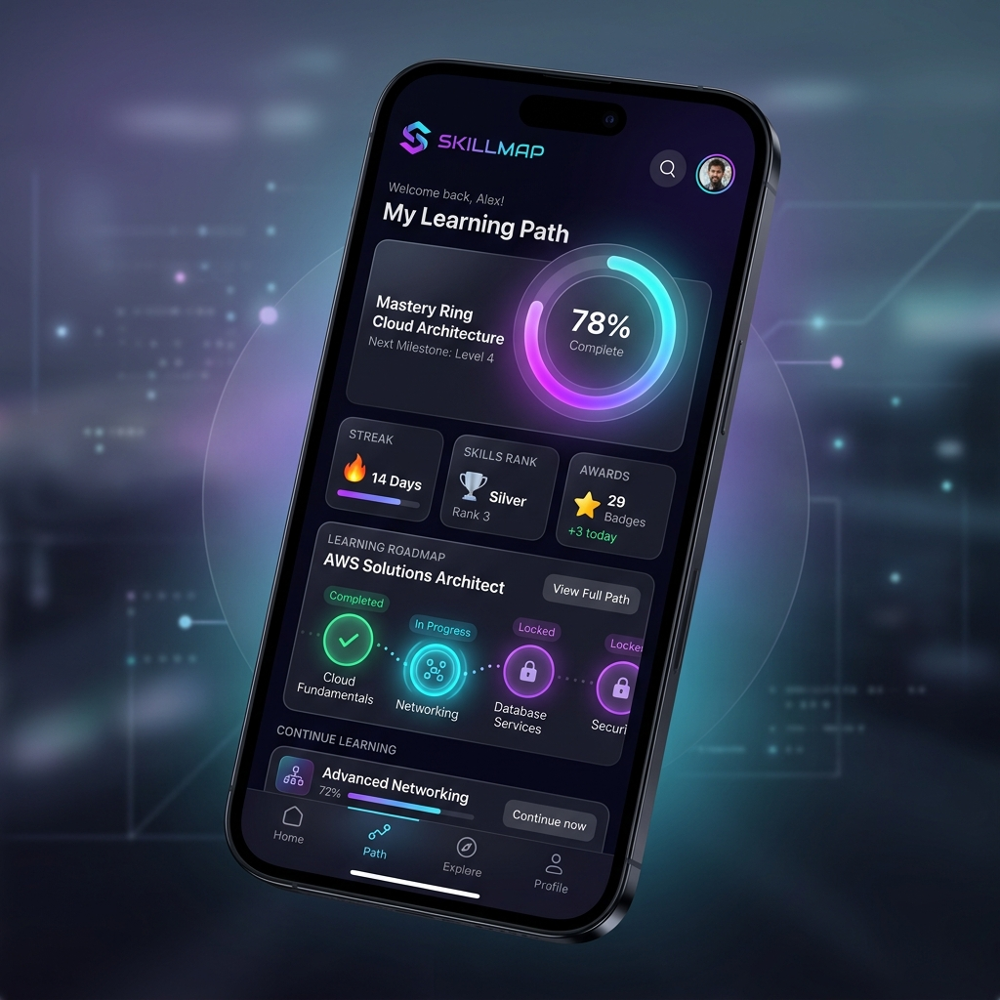

# SkillMap 🚀
**The ultimate technical learning platform for modern developers.**



SkillMap is a premium, high-performance mobile application built with **React Native** and **Expo**. It transforms the daunting task of learning complex technologies into a structured, gamified journey. Featuring an **AI-powered roadmap generator**, **real-time progress tracking**, and a **"Stellar Glass" UI**, SkillMap is designed to help you achieve technical mastery with ease.

---

## ✨ Key Features

### 🤖 AI-Powered Roadmaps
Never wonder "what to learn next" again. Our AI engine generates custom, goal-oriented learning paths based on your topic, time availability, and current skill level.
- **Custom Duration**: From 1 week to 1 year.
- **Tailored Level**: Beginner, Intermediate, or Advanced.
- **Actionable Tasks**: Every week includes specific, measurable tasks and hand-picked resources.

### 🎮 Gamified Experience
Learning is more effective when it's fun. SkillMap incorporates gaming mechanics to keep you motivated:
- **Mastery Ring**: A dynamic SVG visualization of your global progress across all topics.
- **XP System**: Earn experience points for every milestone and task completed.
- **Daily Streaks**: Maintain your learning momentum with flame-tracked streaks.
- **Milestones & Trophies**: Unlock unique rewards as you conquer modules.

### 💎 "Stellar Glass" UI/UX
Experience a premium interface designed for focus and aesthetic pleasure:
- **Bento Stats Grid**: A sleek overview of your most important metrics.
- **Glassmorphism**: Elegant translucent elements with subtle border glows.
- **Micro-animations**: Smooth transitions powered by React Native Reanimated.
- **Dark Mode First**: Optimized for long-night coding sessions.

### 🔐 Secure & Real-time
Powered by **Supabase**, SkillMap ensures your data is always synced and secure:
- **The Vault**: A dedicated area for managing your identity and preferences.
- **Cloud Sync**: Start learning on one device, continue on another.
- **Offline First**: Local caching with AsyncStorage ensures performance even without a connection.

---

## 🛠 Tech Stack

- **Framework**: [Expo](https://expo.dev/) (SDK 54)
- **Language**: [TypeScript](https://www.typescriptlang.org/)
- **State & Data**: [Supabase](https://supabase.com/) (Auth & DB), [AsyncStorage](https://react-native-async-storage.github.io/async-storage/)
- **Animations**: [React Native Reanimated](https://docs.swmansion.com/react-native-reanimated/)
- **Styling**: [Expo Linear Gradient](https://docs.expo.dev/versions/latest/sdk/linear-gradient/), [React Native SVG](https://github.com/software-mansion/react-native-svg)
- **Navigation**: [Expo Router](https://docs.expo.dev/router/introduction/) (File-based)
- **AI Integration**: [OpenRouter API](https://openrouter.ai/) (LLM-agnostic)

---

## 🚀 Getting Started

### 1. Prerequisites
- [Node.js](https://nodejs.org/) (v18+)
- [Expo Go](https://expo.dev/go) on your mobile device

### 2. Installation
```bash
# Clone the repository
git clone https://github.com/dhruvgcs24-programer/SkillMap1.git

# Install dependencies
npm install
```

### 3. Environment Configuration
Create a `.env` file in the root:
```env
EXPO_PUBLIC_SUPABASE_URL=your_supabase_url
EXPO_PUBLIC_SUPABASE_ANON_KEY=your_supabase_anon_key
EXPO_PUBLIC_OPENROUTER_API_KEY=your_api_key  # Optional for AI features
```

### 4. Run the Development Server
```bash
npx expo start
```
Scan the QR code with **Expo Go** (Android) or the **Camera app** (iOS) to view the app on your phone.

---

## 📂 Project Architecture

```text
SkillMap/
├── app/                  # File-based Routing (Expo Router)
│   ├── (tabs)/           # Main Application Shell (Home, Roadmaps, Profile)
│   ├── (auth)/           # Authentication Flow
│   └── _layout.tsx       # Root Provider Configuration
├── components/           # UI Components
│   ├── ui/               # Atomic Design Components (Buttons, Cards)
│   ├── roadmapAI.js      # AI Generation Logic & Prompting
│   └── MasteryRing.js    # Progress Visualization
├── src/
│   ├── data/             # Static Roadmap Definitions
│   ├── services/         # Supabase & API Client Config
│   ├── hooks/            # Custom React Hooks
│   └── constants/        # Theme & Color Tokens
└── assets/               # Branding, Icons, and Lottie Animations
```

---

## 🗺 Available Roadmaps

| Path Type | Current Offerings |
| :--- | :--- |
| **Role-Based** | 🎨 Frontend Engineer, ⚙️ Backend Developer, 📱 React Native Expert |
| **Skill-Based** | 🐍 Python Mastery, 📜 JavaScript Deep Dive, 📊 SQL & Databases |
| **AI-Generated** | ⚡ Any topic of your choice via the AI Assistant |

---

## 🤝 Contributing

We love contributions! Whether it's a bug fix, a new roadmap, or a UI enhancement:
1. **Fork** the repo.
2. Create a **Feature Branch** (`git checkout -b feature/AmazingFeature`).
3. **Commit** your changes (`git commit -m 'Add AmazingFeature'`).
4. **Push** to the branch (`git push origin feature/AmazingFeature`).
5. Open a **Pull Request**.

---

## 📄 License
Distributed under the MIT License. See `LICENSE` for details.

---
Built with 💜 by the SkillMap Team.

